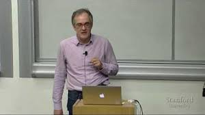

## Assignment solutions for the CS224n course offered by Stanford on Natural Language Processing with Deep Learning

In this repo you can find my coding solutions for the CS224n course offered by Stanford. I thought it might be helpful for other fellow students to share them here.

Here you can find the lecture videos for the CS224n 2017 course:

You can download the raw assignments [here](http://web.stanford.edu/class/cs224n/assignments.html).

### Assignment 1 tasks:
----
* Softmax
* Neural network basics
* Word2vec
* Sentiment analysis

### Assignment 2 tasks:
----
* Tensorflow Softmax
* Neural Transition-Based Dependency Parsing

### Assignment 3 tasks:
----
* A window into NER
* Recurrent neural nets for NER
* Grooving with GRUs

A big thank you to Richard Socher and Christopher Manning for giving open-access to this amazing course. These efforts are truly the ones who will ensure that AI research and progress will be achieved worldwide.
